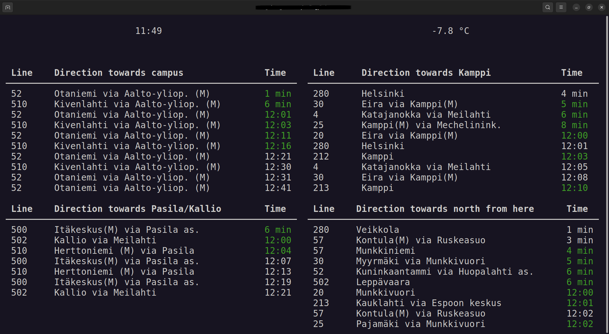

# hsl-screen

A simple terminal application to display the local public transport departure times around a given area.

The application has been deployed to a Raspberry pi model B+ v1.2.

## Requirments

External libraries used:
 - Rich, for terminal UI
 - Requests, to handle HTTP requests
 - urllib3, to set HTTP settings

`python -m pip install rich requests urllib3`

## Use

`python main.py`
